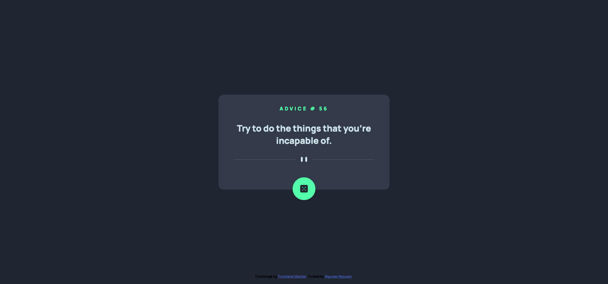

# Frontend Mentor - Advice Generator App

## Table of contents

- [Overview](#overview)
  - [The challenge](#the-challenge)
  - [Screenshot](#screenshot)
  - [Links](#links)
- [My process](#my-process)
  - [Built with](#built-with)
  - [What I learned](#what-i-learned)
  - [Continued development](#continued-development)
  - [Useful resources](#useful-resources)
- [Author](#author)
- [Acknowledgments](#acknowledgments)

## Overview

### The challenge

Users should be able to:

- Generate a new advice each time the dice is clicked.

### Screenshot

### Links

- Solution URL: [View codes](https://github.com/jesuisbienbien/advice-generator-app)
- Live Site URL: [View live site](https://jesuisbienbien.github.io/advice-generator-app/)

## My process

### Built with

- Semantic HTML5 markup
- CSS custom properties
- Flexbox
- Mobile-first workflow
- Vanilla Javascript
- API

### What I learned

### Continued development

### Useful resources

## Author

- Github - [Nguyen Nguyen](https://github.com/jesuisbienbien)
- Frontend Mentor - [@jesuisbienbien](https://www.frontendmentor.io/profile/jesuisbienbien)

## Acknowledgments
